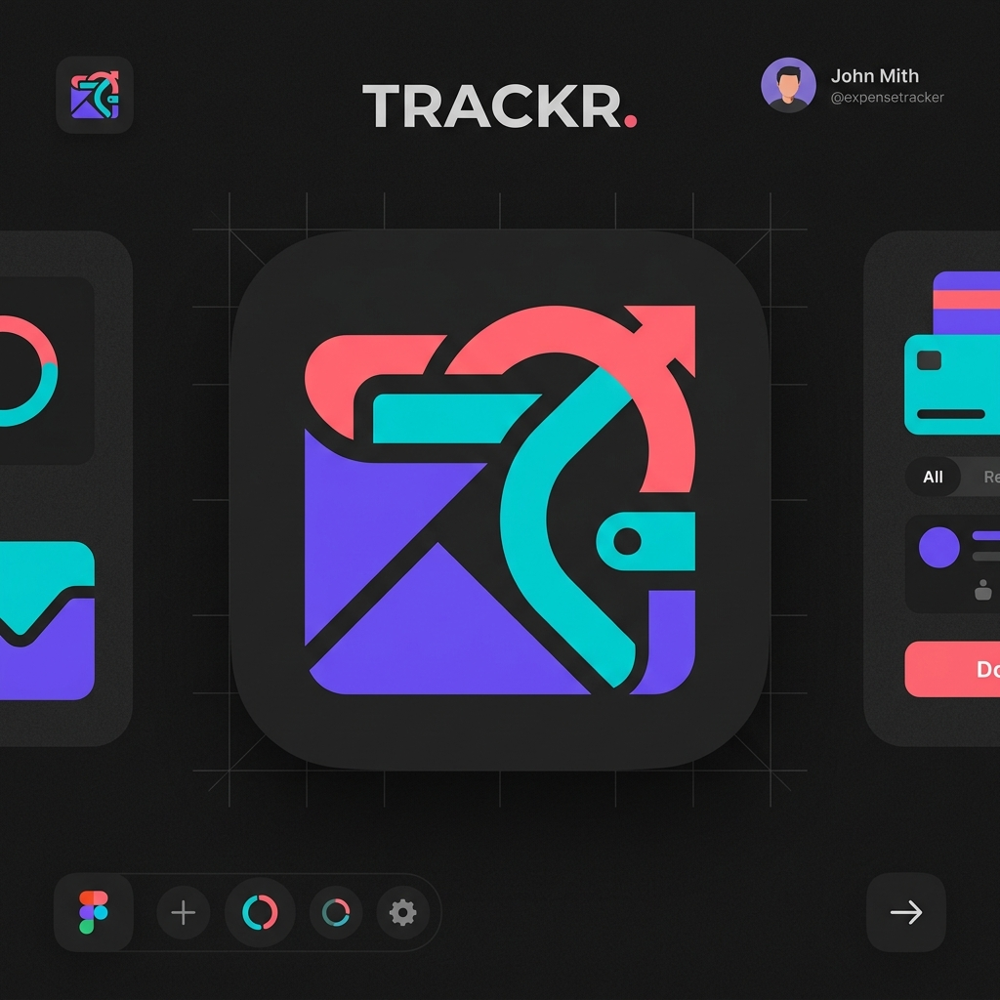

<div align="center">
  
  
  # SpendWise 💸
  
  **Your Personal Finance, Elevated.**

  [](https://reactnative.dev/)
  [](https://expo.dev/)
  [](https://www.typescriptlang.org/)

</div>

---

## 🌟 About SpendWise

SpendWise is a beautiful, modern, and funky expense tracker built to help you manage your personal finances with joy. Featuring a premium **Dynamic Theme Architecture**, it seamlessly adapts to your style while providing powerful insights into your daily spending habits.

## ✨ Features

- 🎨 **Gorgeous Dynamic UI:** "Funky Vibes" aesthetics featuring massive fluid gradients, glassmorphism cards, and a premium 360-degree rainbow rotating floating action button.
- 🌓 **Adaptive Theming:** Instant switching between ultra-sleek Dark Mode and clean Light Mode.
- 💡 **Thought of the Day:** Get a fresh, motivational financial quote every time you open your dashboard to keep your saving goals on track.
- 📊 **Smart Analytics:** Interactive charts showcasing your spending over the last 7 days and categorizing expenses beautifully with a visual pie chart.
- 💵 **Payment Modes Tracking:** Easily track whether you paid via UPI, Cash, or Card.
- 📱 **Cross-Platform:** Built with Expo to run perfectly on both iOS and Android.

## 📸 Screenshots
*(Coming Soon)*

## 🚀 Getting Started

### Prerequisites
Make sure you have Node.js and npm installed. You will also need the [Expo Go](https://expo.dev/client) app on your mobile device to run it locally.

### Installation

1. **Clone the repository**
   ```bash
   git clone https://github.com/your-username/spendwise.git
   cd spendwise
   ```

2. **Install dependencies**
   ```bash
   npm install
   ```

3. **Start the app**
   ```bash
   npx expo start
   ```

4. **Run on your phone**
   Open the **Expo Go** app on your phone and scan the QR code displayed in your terminal.

## 🛠️ Tech Stack
- **Framework:** React Native + Expo Router
- **Language:** TypeScript
- **Styling:** Custom StyleSheet + `expo-linear-gradient`
- **Charts:** `react-native-chart-kit`
- **Storage:** React Native Async Storage (Local Persistence)

---
<div align="center">
  <i>Built for the Summer Build Challenge 2026 ☀️</i>
</div>
